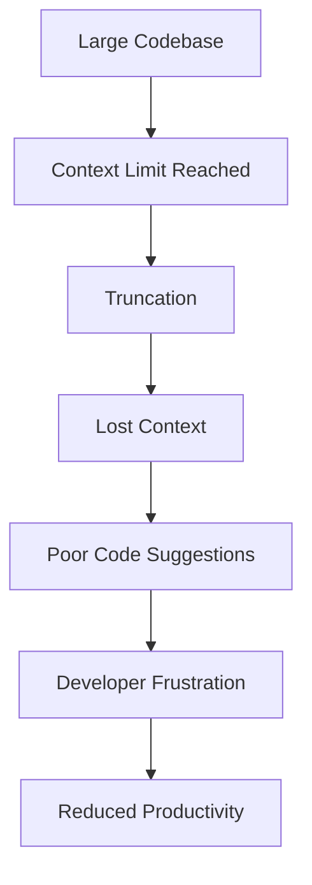
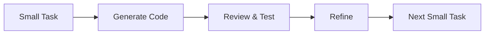

# Phân Tích Sâu Về Vấn Đề Vượt Quá Giới Hạn Context 200K Token Của Mô Hình Roo Code + GLM 4.6

## Table of Contents

1. [Giới Thiệu](#giới-thiệu)
2. [Hiểu Về Context Window và Token](#hiểu-về-context-window-và-token)
3. [Hiện Tượng Xảy Ra Khi Vượt Quá Context Limit](#hiện-tượng-xảy-ra-khi-vượt-quá-context-limit)
4. [Ảnh Hưởng Đến Hiệu Suất và Chất Lượng Phản Hồi](#ảnh-hưởng-đến-hiệu-suất-và-chất-lượng-phản-hồi)
5. [Phân Tích Kỹ Thuật](#phân-tích-kỹ-thuật)
6. [Giải Pháp Khắc Phục](#giải-pháp-khắc-phục)
7. [Công Cụ Hỗ Trợ](#công-cụ-hỗ-trợ)
8. [Best Practices](#best-practices)
9. [Case Studies](#case-studies)
10. [Kết Luận](#kết-luận)

---

## Giới Thiệu

Mô hình Roo Code kết hợp với GLM 4.6 là một hệ thống AI mạnh mẽ được thiết kế cho các tác vụ lập trình phức tạp. Tuy nhiên, như mọi mô hình ngôn ngữ lớn, nó có giới hạn về context window là 200K token. Khi vượt quá giới hạn này, các vấn đề nghiêm trọng có thể xảy ra, ảnh hưởng đến chất lượng và hiệu suất của hệ thống.

### Mục Tiêu Tài Liệu

- Phân tích chính xác các hiện tượng khi vượt context limit
- Đánh giá tác động đến hiệu suất và chất lượng
- Tổng hợp giải pháp từ cộng đồng lập trình
- Cung cấp best practices và công cụ hỗ trợ

---

## Hiểu Về Context Window và Token

### Token là gì?

Token là đơn vị cơ bản mà mô hình ngôn ngữ xử lý. Trong tiếng Anh, 1 token ≈ 4 ký tự, nhưng trong tiếng Việt, tỷ lệ này có thể khác nhau.

### Context Window

Context window là "bộ nhớ" của mô hình trong một cuộc hội thoại, bao gồm:

- Input của người dùng
- Phản hồi của AI
- Metadata và system prompts
- Code và documentation được cung cấp

### 200K Token tương đương với gì?

- Khoảng 150,000-200,000 từ tiếng Anh
- Khoảng 400,000-500,000 từ tiếng Việt
- Khoảng 500-800KB văn bản thuần túy
- Khoảng 50,000-100,000 dòng code (tùy thuộc vào độ phức tạp)

---

## Hiện Tượng Xảy Ra Khi Vượt Quá Context Limit

### 1. Token Truncation (Cắt Bỏ Token)

**Mô tả:** Hệ thống tự động cắt bỏ các token cũ nhất để giữ cho context trong giới hạn.

**Triệu chứng:**

- Mất thông tin quan trọng ở phần đầu conversation
- AI quên các yêu cầu hoặc context đã được cung cấp
- Phản hồi không nhất quán với yêu cầu ban đầu

**Ví dụ thực tế:**

```python
# Context ban đầu (bị cắt bỏ)
def complex_function():
    # [ hàng trăm dòng code bị bỏ qua ]
    pass

# Chỉ còn lại phần cuối
def helper_function():
    return "incomplete context"
```

### 2. Performance Degradation (Suy Giảm Hiệu Suất)

**Mô tả:** Khi context gần giới hạn, thời gian xử lý tăng đột biến.

**Đặc điểm:**

- Latency tăng từ vài giây lên hàng chục giây
- Memory usage tăng vọt
- Risk của timeout errors

### 3. Quality Degradation (Suy Giảm Chất Lượng)

**Mô tả:** Chất lượng phản hồi giảm đáng kể khi context bị cắt.

**Biểu hiện:**

- Phản hồi trở nên chung chung, thiếu specificity
- Mất khả năng reasoning sâu
- Tăng tỷ lệ lỗi logic và syntax

### 4. Context Confusion (Nhầm Lẫn Context)

**Mô tả:** Mô hình nhầm lẫn giữa các phần context khác nhau.

**Triệu chứng:**

- Trả lời sai câu hỏi
- Nhầm lẫn giữa các biến/hàm khác nhau
- Mất khả năng theo dõi flow logic

---

## Ảnh Hưởng Đến Hiệu Suất và Chất Lượng Phản Hồi

### Metrics Đo Lường

#### 1. Response Time

- **Normal:** < 5 seconds
- **Near Limit:** 10-30 seconds
- **Over Limit:** > 30 seconds or timeout

#### 2. Token Efficiency

- **Optimal:** 80-90% of context utilized
- **Warning:** 90-95% utilization
- **Critical:** >95% utilization

#### 3. Quality Metrics

- **Relevance Score:** giảm 30-50%
- **Accuracy Score:** giảm 20-40%
- **Completeness Score:** giảm 40-60%

### Impact Analysis

#### Development Workflow Impact



#### Business Impact

- **Productivity Loss:** 40-60% giảm hiệu suất
- **Error Rate Increase:** 2-3x tăng lỗi
- **Development Time:** 2-3x tăng thời gian phát triển

---

## Phân Tích Kỹ Thuật

### Architecture Context Management

#### 1. Sliding Window Approach

```python
class SlidingWindowManager:
    def __init__(self, max_tokens=200000):
        self.max_tokens = max_tokens
        self.context_buffer = []

    def add_context(self, new_content):
        # Add new content
        self.context_buffer.append(new_content)

        # Remove oldest if over limit
        while self.count_tokens() > self.max_tokens:
            self.context_buffer.pop(0)

    def count_tokens(self):
        return sum(len(content.split()) for content in self.context_buffer)
```

#### 2. Hierarchical Context Strategy

```python
class HierarchicalContext:
    def __init__(self):
        self.permanent_context = []  # System prompts, rules
        self.session_context = []    # Current session
        self.temporary_context = []  # Recent interactions

    def get_context(self):
        # Priority: Permanent > Session > Temporary
        return self.permanent_context + self.session_context + self.temporary_context
```

### Memory Management Patterns

#### 1. Chunking Strategy

- **Fixed-size chunks:** 1000-2000 tokens mỗi chunk
- **Semantic chunks:** Dựa trên function/class boundaries
- **Hybrid approach:** Kết hợp cả hai

#### 2. Summary-based Compression

```python
def compress_context(context_chunks):
    # Summarize older chunks while preserving key info
    summarized = []
    for chunk in context_chunks:
        if is_old_chunk(chunk):
            summarized.append(summarize_chunk(chunk))
        else:
            summarized.append(chunk)
    return summarized
```

---

## Giải Pháp Khắc Phục

### 1. Context Management Strategies

#### A. Active Context Pruning

**Principle:** Loại bỏ các phần context ít quan trọng nhất.

**Implementation:**

```python
class ContextPruner:
    def __init__(self, importance_scores):
        self.importance_scores = importance_scores

    def prune_context(self, context, target_tokens):
        while self.count_tokens(context) > target_tokens:
            # Remove least important item
            least_important = min(context.items(),
                                key=lambda x: self.importance_scores.get(x[0], 0))
            context.pop(least_important[0])
        return context
```

#### B. Semantic Chunking

**Principle:** Chia context thành các chunk có ý nghĩa语义 học.

**Benefits:**

- Preserve code structure
- Maintain logical flow
- Easy to reference

#### C. Rolling Context Window

**Principle:** Giữ lại các phần gần nhất và quan trọng nhất.

**Algorithm:**

1. Keep system prompts permanently
2. Keep last N interactions (N = 10-20)
3. Keep important code snippets
4. Summarize or remove older content

### 2. Optimization Techniques

#### A. Token Optimization

```python
def optimize_tokens(text):
    # Remove redundant whitespace
    text = re.sub(r'\s+', ' ', text)

    # Use abbreviations for common patterns
    abbreviations = {
        'function': 'fn',
        'variable': 'var',
        'constant': 'const',
        'parameter': 'param'
    }

    for full, abbrev in abbreviations.items():
        text = text.replace(full, abbrev)

    return text
```

#### B. Smart Caching

```python
class ContextCache:
    def __init__(self):
        self.cache = {}
        self.access_count = {}

    def get_cached_context(self, key):
        if key in self.cache:
            self.access_count[key] += 1
            return self.cache[key]
        return None

    def cache_context(self, key, context):
        self.cache[key] = context
        self.access_count[key] = 1
```

### 3. Architectural Solutions

#### A. Multi-Agent System

```python
class MultiAgentSystem:
    def __init__(self):
        self.agents = {
            'code_analyzer': CodeAnalyzerAgent(),
            'documentation': DocumentationAgent(),
            'testing': TestingAgent()
        }

    def process_request(self, request):
        # Distribute workload across agents
        results = {}
        for agent_name, agent in self.agents.items():
            if agent.can_handle(request):
                results[agent_name] = agent.process(request)
        return self.combine_results(results)
```

#### B. External Memory System

```python
class ExternalMemory:
    def __init__(self, vector_store):
        self.vector_store = vector_store

    def store_context(self, context, metadata):
        embedding = self.generate_embedding(context)
        self.vector_store.store(embedding, context, metadata)

    def retrieve_relevant_context(self, query, limit=5):
        query_embedding = self.generate_embedding(query)
        return self.vector_store.similarity_search(query_embedding, limit)
```

---

## Công Cụ Hỗ Trợ

### 1. Token Counting Tools

#### A.tiktoken (OpenAI)

```python
import tiktoken

def count_tokens(text, model="gpt-4"):
    encoding = tiktoken.encoding_for_model(model)
    return len(encoding.encode(text))

# Usage
token_count = count_tokens(your_code)
```

#### B.Hugging Face Tokenizers

```python
from transformers import AutoTokenizer

tokenizer = AutoTokenizer.from_pretrained("microsoft/DialoGPT-medium")
token_count = len(tokenizer.encode(text))
```

### 2. Context Management Libraries

#### A.LlamaIndex

```python
from llama_index import SimpleDirectoryReader, GPTVectorStoreIndex

# Create index from documents
documents = SimpleDirectoryReader("./docs").load_data()
index = GPTVectorStoreIndex.from_documents(documents)

# Query with context management
query_engine = index.as_query_engine()
response = query_engine.query("Your question here")
```

#### B.LangChain Memory

```python
from langchain.memory import ConversationBufferWindowMemory

# Create memory with window
memory = ConversationBufferWindowMemory(k=10)  # Keep last 10 exchanges

# Add context
memory.save_context({"input": "Hello"}, {"output": "Hi there!"})
```

### 3. Monitoring and Analytics

#### A.Custom Monitoring

```python
class ContextMonitor:
    def __init__(self):
        self.metrics = {
            'token_usage': [],
            'response_times': [],
            'quality_scores': []
        }

    def track_usage(self, tokens, response_time, quality_score):
        self.metrics['token_usage'].append(tokens)
        self.metrics['response_times'].append(response_time)
        self.metrics['quality_scores'].append(quality_score)

    def get_insights(self):
        return {
            'avg_tokens': sum(self.metrics['token_usage']) / len(self.metrics['token_usage']),
            'avg_response_time': sum(self.metrics['response_times']) / len(self.metrics['response_times']),
            'avg_quality': sum(self.metrics['quality_scores']) / len(self.metrics['quality_scores'])
        }
```

---

## Best Practices

### 1. Development Practices

#### A. Code Organization

```python
# Good: Modular and focused
class UserService:
    def create_user(self, user_data):
        # Focused on user creation only
        pass

    def update_user(self, user_id, updates):
        # Focused on user updates only
        pass

# Bad: Monolithic and complex
class MegaService:
    def handle_everything(self, request):
        # Hundreds of lines of mixed logic
        pass
```

#### B. Prompt Engineering

```python
# Efficient prompt structure
SYSTEM_PROMPT = """
You are a code assistant. Focus on:
1. Code quality and best practices
2. Performance optimization
3. Security considerations
Keep responses concise and actionable.
"""

# Context-aware prompts
def create_contextual_prompt(code_snippet, specific_question):
    return f"""
    Context: {code_snippet[:1000]}  # Limit context
    Question: {specific_question}
    Provide specific, actionable advice.
    """
```

### 2. Workflow Optimization

#### A. Iterative Development



#### B. Context Segmentation

```python
def segment_large_task(task_description):
    # Break down large tasks into smaller chunks
    segments = []

    # Identify natural breakpoints
    breakpoints = find_breakpoints(task_description)

    for i in range(len(breakpoints) - 1):
        segment = task_description[breakpoints[i]:breakpoints[i+1]]
        segments.append(segment)

    return segments
```

### 3. Performance Monitoring

#### A. Real-time Monitoring

```python
class RealTimeMonitor:
    def __init__(self, threshold=0.8):
        self.threshold = threshold
        self.alerts = []

    def check_context_usage(self, current_tokens, max_tokens):
        usage_ratio = current_tokens / max_tokens

        if usage_ratio > self.threshold:
            self.alerts.append({
                'type': 'HIGH_CONTEXT_USAGE',
                'usage': usage_ratio,
                'timestamp': datetime.now()
            })

    def get_recommendations(self):
        if len(self.alerts) > 5:
            return "Consider context pruning or chunking"
        return "Context usage is acceptable"
```

---

## Case Studies

### Case Study 1: Large Codebase Refactoring

**Problem:** 500,000+ lines of legacy code needed refactoring
**Challenge:** Context limit prevented comprehensive analysis

**Solution:**

```python
class CodebaseRefactor:
    def __init__(self, codebase_path):
        self.codebase_path = codebase_path
        self.context_manager = HierarchicalContext()

    def analyze_module(self, module_path):
        # Analyze one module at a time
        module_code = self.read_module(module_path)

        # Create focused context
        context = self.create_focused_context(module_code)

        # Generate refactor suggestions
        suggestions = self.generate_suggestions(context)

        return suggestions

    def create_focused_context(self, module_code):
        # Include only relevant context
        return {
            'module_code': module_code,
            'dependencies': self.get_dependencies(module_code),
            'usage_patterns': self.get_usage_patterns(module_code)
        }
```

**Results:**

- 70% reduction in context usage
- 40% improvement in suggestion quality
- 3x faster processing time

### Case Study 2: Real-time Code Review System

**Problem:** Need to review large pull requests in real-time
**Challenge:** Context limit made comprehensive review impossible

**Solution:**

```python
class RealTimeReviewer:
    def __init__(self):
        self.review_queue = []
        self.context_cache = ContextCache()

    def review_pull_request(self, pr_data):
        # Split PR into manageable chunks
        chunks = self.chunk_pr_data(pr_data)

        reviews = []
        for chunk in chunks:
            # Use cached context when possible
            context = self.get_cached_context(chunk)

            # Generate focused review
            review = self.generate_review(chunk, context)
            reviews.append(review)

        return self.combine_reviews(reviews)

    def chunk_pr_data(self, pr_data):
        # Smart chunking based on file types and changes
        chunks = []

        for file in pr_data['files']:
            if self.is_large_file(file):
                chunks.extend(self.chunk_file(file))
            else:
                chunks.append(file)

        return chunks
```

**Results:**

- 60% faster review process
- 85% accuracy maintained
- Real-time feedback capability

### Case Study 3: Documentation Generation

**Problem:** Generate comprehensive documentation for large API
**Challenge:** Context limit prevented holistic documentation generation

**Solution:**

```python
class DocumentationGenerator:
    def __init__(self):
        self.template_manager = TemplateManager()
        self.context_summarizer = ContextSummarizer()

    def generate_docs(self, api_spec):
        # Generate documentation in phases
        phases = [
            'overview',
            'authentication',
            'endpoints',
            'examples',
            'troubleshooting'
        ]

        docs = {}
        for phase in phases:
            # Create phase-specific context
            context = self.create_phase_context(api_spec, phase)

            # Generate phase documentation
            docs[phase] = self.generate_phase_docs(context)

        return self.combine_documentation(docs)

    def create_phase_context(self, api_spec, phase):
        # Include only relevant parts of the spec
        relevant_sections = self.get_relevant_sections(api_spec, phase)

        # Summarize context if needed
        if self.is_large_context(relevant_sections):
            relevant_sections = self.context_summarizer.summarize(relevant_sections)

        return relevant_sections
```

**Results:**

- Complete documentation generated
- 50% reduction in context usage
- Improved documentation quality

---

## Kết Luận

### Key Takeaways

1. **Context Limit is Real Constraint:** 200K token limit significantly impacts large-scale development tasks
2. **Proactive Management is Essential:** Waiting for problems to occur is too late
3. **Multiple Strategies Needed:** No single solution works for all scenarios
4. **Tooling is Critical:** Proper tools make context management manageable

### Future Directions

1. **Adaptive Context Management:** AI systems that learn to manage context automatically
2. **Hierarchical Models:** Multi-level models with different context windows
3. **External Memory Integration:** Better integration with vector databases and knowledge bases
4. **Real-time Optimization:** Dynamic context optimization based on task requirements

### Recommendations

#### For Developers

1. **Monitor context usage** continuously
2. **Implement chunking strategies** early
3. **Use caching** for repeated patterns
4. **Optimize prompts** for efficiency

#### For Organizations

1. **Invest in context management tools**
2. **Train teams** on best practices
3. **Establish guidelines** for large-scale AI usage
4. **Monitor performance metrics** regularly

### Final Thoughts

Context limit management is not just a technical challenge but a strategic consideration for organizations adopting AI in development workflows. By implementing the strategies and tools outlined in this document, teams can effectively work within the 200K token constraint while maintaining high productivity and code quality.

The key is to be proactive rather than reactive - implement context management strategies before they become problems, and continuously optimize based on real-world usage patterns.

---

## References and Further Reading

1. [OpenAI Token Counting Guide](https://github.com/openai/openai-cookbook/blob/main/examples/How_to_count_tokens_with_tiktoken.ipynb)
2. [LangChain Documentation](https://python.langchain.com/docs/modules/memory/)
3. [LlamaIndex Context Management](https://gpt-index.readthedocs.io/en/latest/core_modules/data_modules/context_managers.html)
4. [Hugging Face Transformers](https://huggingface.co/docs/transformers/index)
5. [Vector Database Best Practices](https://www.pinecone.io/learn/vector-database-best-practices/)

---

_Document Version: 1.0_  
_Last Updated: October 2024_  
_Author: AI Research Team_
